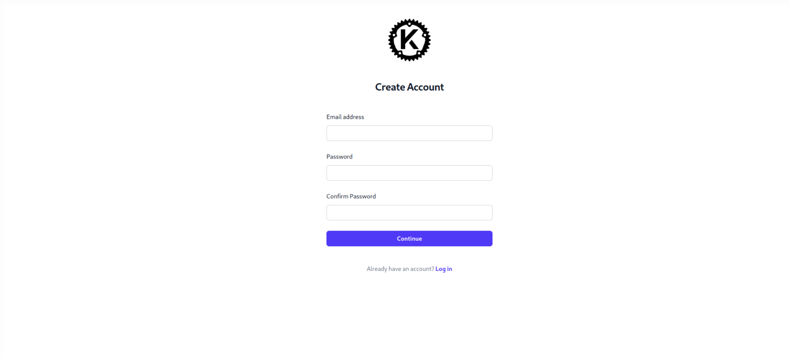
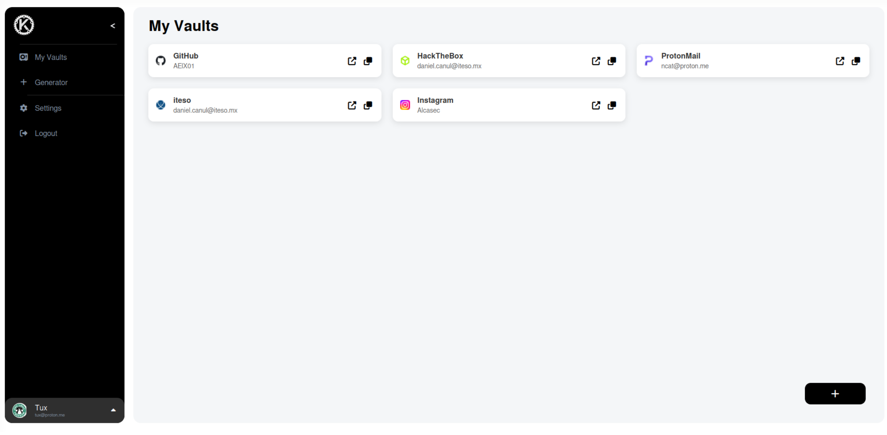

  

A web-based password manager with a Rust cryptography backend.

## features

- Website icons
- Personal vault
- Rust backend 
- Password generation
- Username generation

## security

- Encryption happens in frontend using ChaCha20-Poly1305

> [!IMPORTANT]
> **This is a personal project, feel free to modify anything...**

## Screenshots

Login: 

Home:

